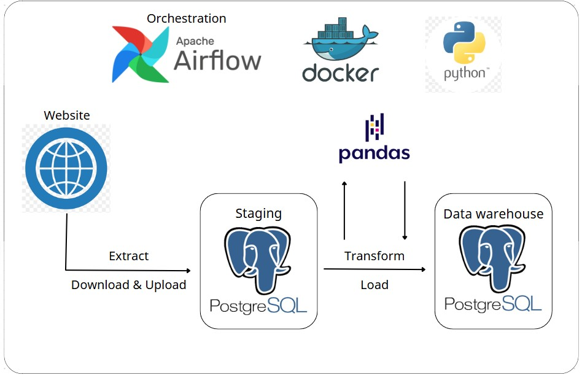

# Data Pipeline with Airflow-Docker

🚀 In this repo, I will get familiar with a data pipeline using ETL.

Key languages and data platforms of the repo:

I am using website https://www.nyc.gov/site/tlc/about/tlc-trip-record-data.page to collect data by downloading from it. Then upload it to **PostgreSQL** called staging area. Then transform the staging by using **python-pandas** and load into data warehouse (**PostgreSQL**). 
**Apache Airflow** orchestrated the entire workflow, ensure smoothness from extraction to transformation.
Containerized the project using **Docker** for seamless environment management and consistent deployment.

🚀 About dataset:

🚀 Data warehouse:
